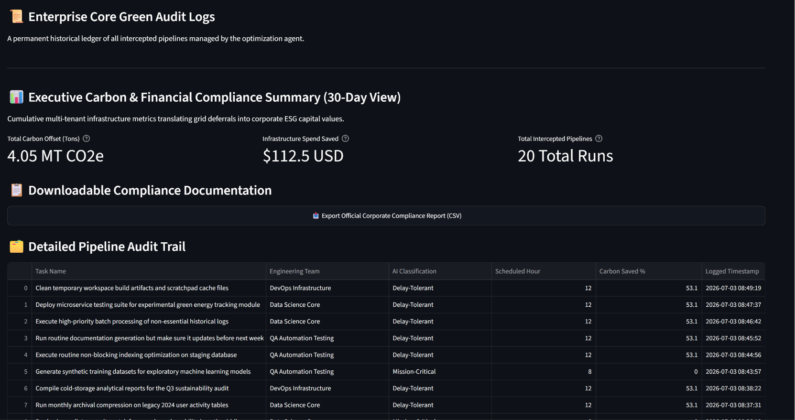
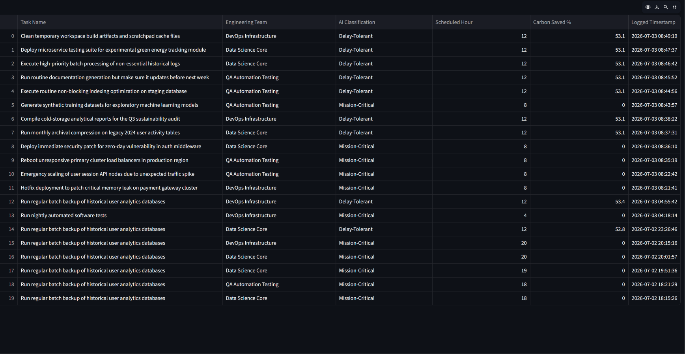

# 🌱 EcoOps AI – Enterprise Sustainability Portal

EcoOps AI is an **intelligent, context-aware green computing traffic controller** built to address two critical enterprise challenges:

- 🌍 Helping enterprises measure, manage, and report cloud-related carbon emissions for sustainability and ESG reporting (including Scope 3 emissions)
- 💰 Reducing cloud computing costs by intelligently scheduling workloads during low-carbon energy periods

---

# 🚀 The Real-World Problem

Large enterprises execute thousands of analytics pipelines, software builds, AI training jobs, and reporting workflows every day. Many of these workloads are **not time-sensitive**, yet they are often executed during peak electricity demand when the power grid relies heavily on fossil fuels.

**EcoOps AI automatically identifies delay-tolerant workloads and reschedules them to periods when renewable energy availability is higher, reducing both carbon emissions and operational costs.**

---

# ✨ Core System Features

### 🧠 Predictive Analytics Engine (`brain.py`)

- Trains a **RandomForestRegressor** using historical electricity grid data.
- Predicts the cleanest and most cost-efficient execution windows.

### 🤖 Context-Aware AI Classifier (`classifier.py`)

- Uses an LLM (`gpt-4o-mini`) to analyze deployment requests written in natural language.
- Determines whether a task is:
  - Immediate
  - Delay-Tolerant

### ⚡ Data Ingestion Service (`main.py`)

- Built with **FastAPI**
- Provides asynchronous APIs for cloud workload processing.

### 📊 Enterprise Dashboard (`dashboard.py`)

- Built using **Streamlit**
- Displays:
  - Carbon savings
  - Financial savings
  - Historical workload logs
  - Sustainability metrics

---

# 🛠️ Technology Stack

| Category | Technologies |
|----------|--------------|
| Language | Python 3.11+ |
| Backend | FastAPI, Uvicorn |
| Machine Learning | Scikit-Learn, Pandas, NumPy |
| AI | OpenAI GPT-4o-mini |
| Environment | Python-Dotenv |
| Dashboard | Streamlit |

---

# 💻 Installation & Setup

Follow these steps to run EcoOps AI locally.

## 1. Clone the Repository

```bash
git clone https://github.com/<your-username>/ecoops-ai.git
cd ecoops-ai
```

---

## 2. Install Dependencies

```bash
pip install -r requirements.txt
```

---

## 3. Configure the Local AI Engine

Ensure Ollama is installed and running, then download the required model.

```bash
ollama run llama3
```

---

## 4. Launch the Application

Open **two terminals**.

### Terminal 1 — Start the FastAPI Backend

```bash
uvicorn main:app --reload
```

### Terminal 2 — Start the Streamlit Dashboard

```bash
streamlit run dashboard.py
```

---

## 5. Open the Dashboard

Navigate to:

```
http://localhost:8501
```

---

# 🧪 Automated Stress Testing & Validation

## Test Suite 1 — Multi-Tenant Concurrent Pipeline Stress Test

To validate database consistency, workload classification, and AI decision quality, EcoOps AI processed **12 diverse enterprise cloud workloads** sequentially under simulated production conditions.

## 📈 Validation Results

### ✅ Database & Data Integrity

- Successfully processed and logged every workload.
- Expanded the execution ledger to **20 total records** with no dropped requests.

### ✅ ESG & Financial Calculations

Accurately calculated:

- **4.05 MT CO₂e** emissions avoided
- **$112.50 USD** estimated infrastructure savings

without numerical precision errors.

### ✅ AI Classification Accuracy

The language model successfully classified ambiguous deployment instructions.

Example:

> "Run routine documentation generation but make sure it updates before next week."

Correctly classified as:

**Delay-Tolerant**

allowing execution during a lower-carbon energy window.

### ✅ Compliance Reporting

Generated a complete **20-row enterprise audit workbook** suitable for sustainability reporting and compliance documentation.

---

# 📊 Execution Visual Proof

| Enterprise Dashboard | Exported Compliance Report |
|----------------------|----------------------------|
|  |  |

---

The complete audit workbook can be found here:

📄 **[ecoops_sustainability_compliance_report.xlsx](./ecoops_sustainability_compliance_report.xlsx)**

---

### Test Suite 2: Core API Offline & Telemetry Ingestion Simulation
To verify enterprise resiliency, the live external telemetry endpoint (`PUBLIC_GRID_API_URL`) was intentionally routed to a non-existent URL (`/broken-endpoint-test`) to simulate a live grid feed outage or malicious payload scenario.

#### 📈 Key Validation Outcomes:
* **Fault-Tolerant Microservice Fallback:** The ingestion engine detected the connection failure without crashing, cleanly logging `[⚠️ Ingestion Warning] Live feed offline...` in Terminal 1.
* **Seamless UI Resilience:** The Streamlit dashboard intercepted the API error, instantly activating the internal simulation core fallback values ($150\text{ gCO}_2/\text{kWh}$) to generate the 24-hour predictive timeline without displaying red runtime errors.
* **Data Continuity:** Pipeline requests continued executing seamlessly, scaling the total ledger from **20 to 21 Total Runs** during offline mode.

# 📄 License

This project is intended for educational and portfolio purposes.